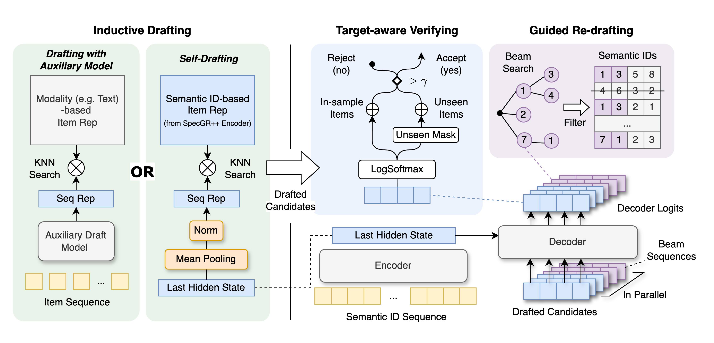

# Speculative Generative Recommendation

This is the official PyTorch implementation of the paper **Speculative Generative Recommendation**.

## Introduction

**Speculative Generative Recommendation (SpecGR)** is a plug-and-play framework designed to enable any Generative Recommendation (GR) model to recommend new, unseen items in an inductive setting. While GR models excel at predicting and recommending items by generating token sequences, they struggle to recommend new items not encountered during training. SpecGR addresses this limitation with a framework consisting of two key components:

- **Drafter Model:** A model with strong inductive recommendation capability that proposes 'candidates' (potentially new items).

- **Verifier:** The GR model then evaluates these candidates, determining which to accept or reject based on their likelihood of being generated.

Building upon this framework, we propose two drafting strategies:
1. [**SpecGR<sub>Aux</sub>**](SpecGR_Aux): **Drafting with an auxiliary model.** This strategy uses an external drafter model for enhanced flexibility.
2. [**SpecGR++**](SpecGR): **Self-drafting with the GR model's encoder.** This approach leverages the GR model's encoder for a parameter-efficient, integrated method. It involves a two-stage training process and requires no modifications to the GR architecture, leading to more efficient recommendations.




## Requirements

To install the required dependicies, simply run:

```bash
pip install -r requirements.txt
```

## Model Checkpoints

In the paper, extensive experiments were conducted on three datasets: **Video Games**, **Office Products**, and **Cell Phones & Accessories**. You can download the semantic IDs and trained SpecGR checkpoints [**here**](https://drive.google.com/drive/u/1/folders/1kbKt-J6srLye8-8f6e94nqc1XRvBe3Lu).

## Quick Start

### Data Preprocessing

To download and process datasets from scratch, run:

```bash
python -m dataset.process_datasets --config CONFIG_PATH --device GPU_ID
```

### Run SpecGR for Recommendation Using Preprocessed Data and Checkpoints

```bash
bash quick_start.sh
```

## Training

### End-to-End DDP Training for SpecGR++ with PyTorch Lightning

To start end-to-end training, run:

```bash
python -m SpecGR.train --config CONFIG_PATH --devices GPU_IDS
```

### Training SpecGR with an Auxiliary Draft Model

#### Draft Model Options:
- **UniSRec:** Uses PLM (Pretrained Language Model) text embeddings as universal item representations, achieving strong inductive recommendation performance. [Paper](https://arxiv.org/abs/2206.05941)

#### Generative Recommendation Model Options:
- **TIGER:** Encodes item metadata into semantic IDs and predicts the next item by generating semantic IDs. [Paper](https://openreview.net/forum?id=BJ0fQUU32w)

For single-GPU end-to-end training of both the draft and generative models, run:

```bash
python -m SpecGR_Aux.train --config CONFIG_PATH --device GPU_ID
```

## Inference

### Run SpecGR++ for Recommendation

To run SpecGR++ with DDP acceleration for recommendation, run:

```bash
python -m SpecGR.run --config CONFIG_PATH --eval_mode EVAL_MODEL --draft_size DRAFT_SIZE --num_beams NUM_BEAMS --threshold THRESHOLD --max_eval_steps MAX_EVAL_STEPS --devices GPUS_IDS
```

### Run SpecGR with an Auxiliary Draft Model for Recommendation

To run SpecGR with an auxiliary draft model for recommendation, run:

```bash
python -m SpecGR_Aux.run --config CONFIG_PATH --eval_mode EVAL_MODEL --draft_size DRAFT_SIZE --num_beams NUM_BEAMS --threshold THRESHOLD --max_eval_steps MAX_EVAL_STEPS --device GPU_ID
```
